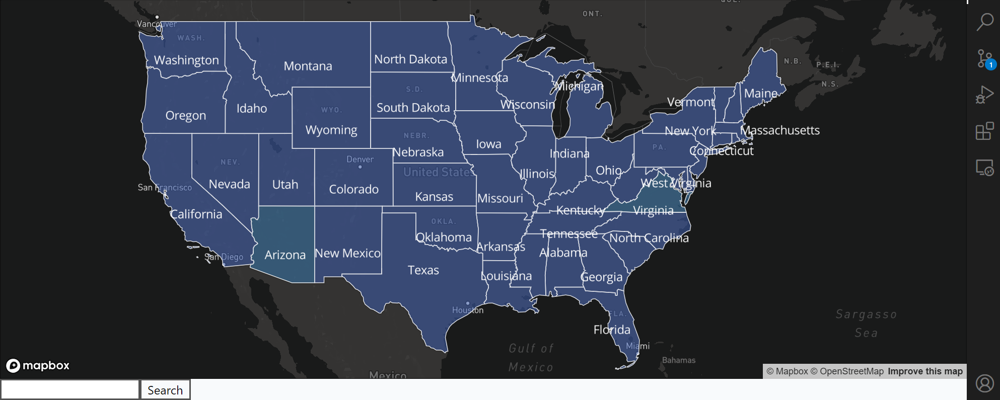
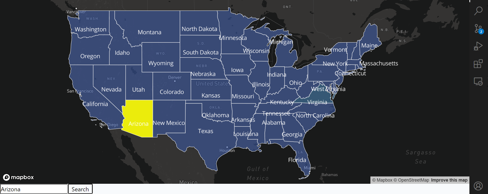
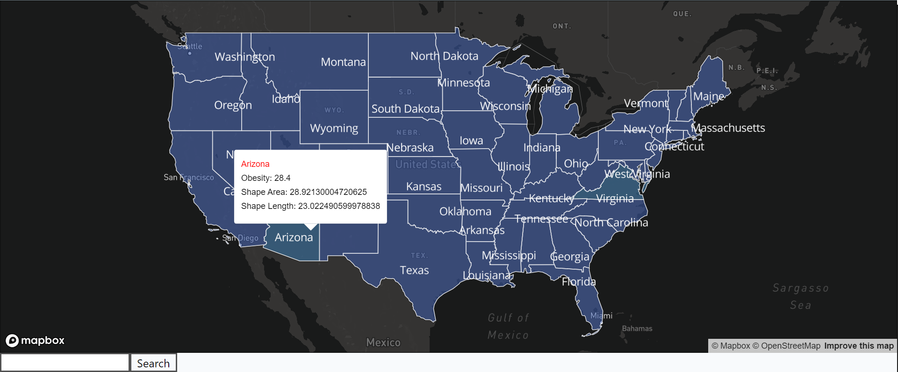

# Map Visualization of State Obesity Statistics

## Overview

This project leverages React, Next.js, and Mapbox to create an interactive map application for visualizing obesity statistics in various states. The application utilizes Mapbox GL for mapping functionalities. Key features and components include:


**1.Interactive Map:**
- The project incorporates Mapbox GL, a powerful mapping library, to create an interactive map interface.

**2.Data Visualization:**

- GeoJSON data representing obesity statistics for different states is loaded onto the map, allowing users to visualize and analyze the data visually.
- The map layers are styled to represent the states marked using colors and opacity.

**3.Search Functionality:**

- Users can search for specific states using a search bar. When a state is searched, the application highlights the corresponding area on the map, providing a clear focus on the selected state's obesity data.


**4.User Interaction:**

- The application provides a seamless user experience with interactive features. Users can click on map features to view detailed information about a specific state's obesity statistics, including obesity rate, shape area, and shape length.


## Technologies Used

- **React:** A JavaScript library for building user interfaces.
- **Next.js:** A React framework for building server-rendered applications.
- **Tailwind CSS:** A utility-first CSS framework for rapid UI development.
- **TypeScript:** A statically typed superset of JavaScript that adds optional types.
- **Mapbox GL:** Versatility and powerful mapping capabilities, allowing for easy integration of interactive maps.
- **ESLint:** Static code analysis tool for identifying and fixing problems in JavaScript code

**Why React.js, Next.js and TypeScript?**
I choose to use React, Next.js, and TypeScript in my projects because of the unparalleled advantages they offer in terms of development speed, maintainability, and scalability. React's component-based architecture allows me to build modular and reusable user interfaces, making it easier to manage complex applications. Next.js, being a powerful React framework, simplifies server-side rendering, routing, and deployment, providing a efficient and optimized user experience with SSR and SSG feature by default. Additionally, TypeScript enhances my productivity by adding static types, enabling early error detection, and improving code readability, which leads to more reliable and maintainable code. The combination of React, Next.js, and TypeScript not only streamlines my development process but also ensures the creation of robust, high-quality web applications tailored to my project requirements.

**Why Tailwind CSS?**
I choose to use Tailwind CSS in my projects because of its high-efficient speed and simplicity. With Tailwind, I can rapidly develop stylish and responsive user interfaces without the hassle of writing extensive custom CSS. Its utility-first approach aligns perfectly with my workflow, allowing me to focus on functionality rather than spending time on intricate styling.

## Accomplishments

- Implemented an interactive map using React-Map-GL.
- Integrated state obesity statistics in GeoJSON format.
- Implemented search and filtering functionality for data points on the map.
- Utilized Tailwind CSS for responsive and modern UI design.
- Enhanced user experience with smooth map interactions.

## Installation and Setup

1. **Clone the repository:**

   ```bash
   git clone <repository-url>
   cd map-visualization
   ``` 
2. **Install dependencies:**

    ```bash
    npm install
    ```
3. **Set up environment variables:**
    Create a **'.env.local'** file in the project root and add your Mapbox access token:

    ```bash
    NEXT_PUBLIC_MAPBOX_ACCESS_TOKEN=your-mapbox-access-token
    ```
    Replace **'your-mapbox-access-token'** with your actual Mapbox access token.
4. **Run the application:**

    ```bash
    npm run dev
    ``````
    The application will be accessible at **'http://localhost:3000'**.

## Usage
 - **Exploring the Map:**
    - Use the mouse or touch gestures to pan and zoom the map.
    - Interact with the map to view different state obesity statistics.
- **Search and Filter:**
    - Use the search bar to find specific locations on the map.
    - Click a specific state to get the infomation like shape length, shape area and obesity.